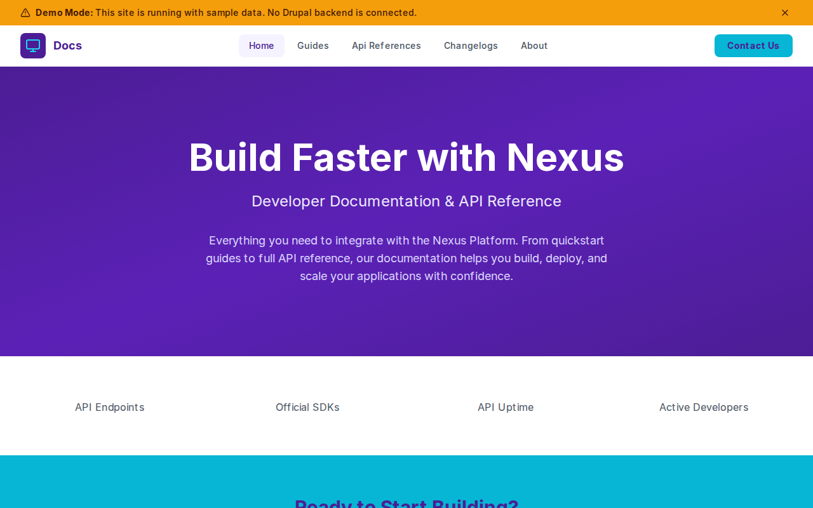

# Decoupled Docs

A developer documentation website starter template for Decoupled Drupal + Next.js. Built for API platforms, SaaS products, and developer tools that need structured documentation sites.



## Features

- **Developer Guides** - Tutorials with difficulty levels, reading times, prerequisites, and topic areas
- **API Reference** - Endpoint documentation with HTTP methods, parameters, response codes, and rate limits
- **Changelog** - Version release notes with highlights, release types, and breaking change flags
- **Modern Design** - Clean, accessible UI optimized for technical documentation content

## Quick Start

### 1. Clone the template

```bash
npx degit nextagencyio/decoupled-docs my-docs
cd my-docs
npm install
```

### 2. Run interactive setup

```bash
npm run setup
```

This interactive script will:
- Authenticate with Decoupled.io (opens browser)
- Create a new Drupal space
- Wait for provisioning (~90 seconds)
- Configure your `.env.local` file
- Import sample content

### 3. Start development

```bash
npm run dev
```

Visit [http://localhost:3000](http://localhost:3000)

---

## Manual Setup

<details>
<summary>Click to expand manual setup steps</summary>

### Authenticate with Decoupled.io

```bash
npx decoupled-cli@latest auth login
```

### Create a Drupal space

```bash
npx decoupled-cli@latest spaces create "My Docs"
```

Note the space ID returned. Wait ~90 seconds for provisioning.

### Configure environment

```bash
npx decoupled-cli@latest spaces env 1234 --write .env.local
```

### Import content

```bash
npm run setup-content
```

This imports:
- Homepage with hero section and platform statistics
- 4 developer guides (Quickstart, Authentication, Data Models, Deployment Best Practices)
- 3 API reference pages (List Records, Create Record, Delete Record)
- 3 changelog entries (v2.4.0, v2.3.0, v2.2.1)
- About page and SDKs & Libraries page
- Difficulty levels (Beginner, Intermediate, Advanced)
- Topic areas (Getting Started, Authentication, Data Models, Integrations, Deployment, Performance, Security)
- Release types (Major, Minor, Patch, Security)

</details>

## Content Types

### Guide
- **difficulty_level**: Skill level required (Beginner, Intermediate, Advanced)
- **reading_time**: Estimated time to read the guide
- **topic_area**: Subject area taxonomy
- **prerequisites**: List of prerequisite guides or knowledge
- **author_name**: Author of the guide
- **last_updated**: Date the guide was last revised
- **image**: Illustration or screenshot for the guide

### API Reference
- **http_method**: HTTP verb (GET, POST, PUT, DELETE, etc.)
- **endpoint_path**: API endpoint URL path
- **api_version**: API version string
- **auth_required**: Whether authentication is needed
- **rate_limit**: Rate limiting information
- **parameters**: List of accepted parameters
- **response_codes**: Possible HTTP response codes with descriptions

### Changelog
- **version_number**: Semantic version number
- **release_date**: Date the version was released
- **release_type**: Category of release (Major, Minor, Patch, Security)
- **breaking_changes**: Whether the release includes breaking changes
- **highlights**: Key items in the release

## Customization

### Colors & Branding
Edit `tailwind.config.js` to customize colors, fonts, and spacing.

### Content Structure
Modify `data/docs-content.json` to add or change content types and sample content.

### Components
React components are in `app/components/`. Update them to match your design needs.

## Demo Mode

Demo mode allows you to showcase the application without connecting to a Drupal backend.

### Enable Demo Mode

```bash
NEXT_PUBLIC_DEMO_MODE=true
```

### Removing Demo Mode

1. Delete `lib/demo-mode.ts`
2. Delete `data/mock/` directory
3. Delete `app/components/DemoModeBanner.tsx`
4. Remove `DemoModeBanner` from `app/layout.tsx`
5. Remove demo mode checks from `app/api/graphql/route.ts`

## Deployment

### Vercel (Recommended)
[](https://vercel.com/new/clone?repository-url=https://github.com/nextagencyio/decoupled-docs)

### Other Platforms
Works with any Node.js hosting platform that supports Next.js.

## Documentation

- [Decoupled.io Docs](https://www.decoupled.io/docs)
- [Next.js Documentation](https://nextjs.org/docs)
- [Drupal GraphQL](https://www.decoupled.io/docs/graphql)

## License

MIT
